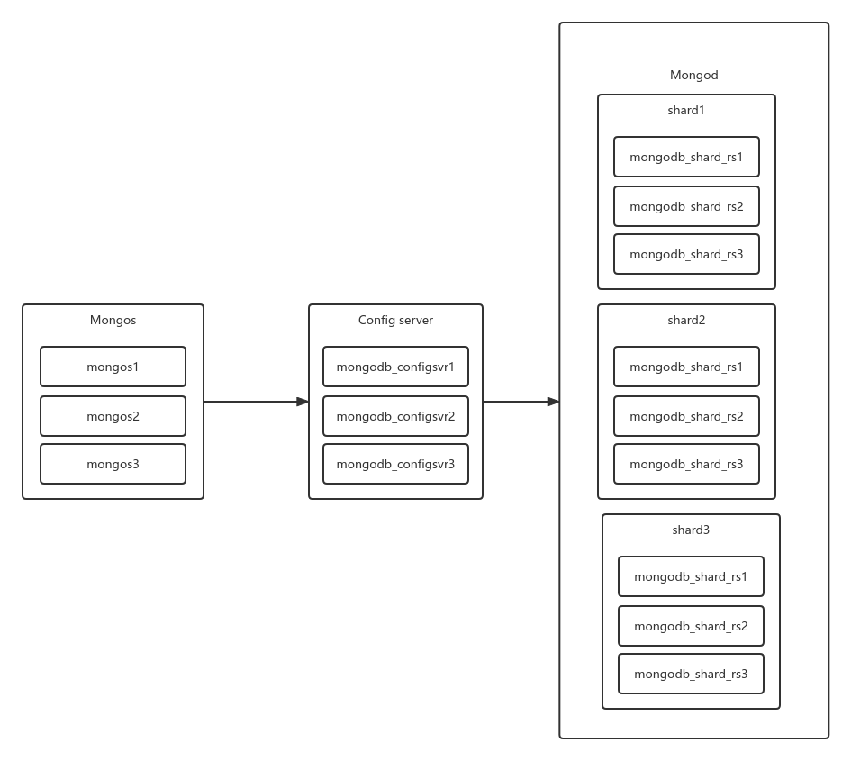

# mongo切片集群安装文档

[TOC]

## 零 备注

本次部署使用`5.0.2`版本安装包进行演示

## 一 系统环境

### 1 mongo切片集群架构



### 2 配置信息

> 由于单机部署,所以端口号递增,多机部署可考虑使用同一个端口值

| IP地址    | 域名        | Mongos | Config server | shard1 | shard2 | shard3 |
| --------- | ----------- | ------ | ------------- | ------ | ------ | ------ |
| 127.0.0.1 | mongo_node1 | 27011  | 27021         | 27031  | 27041  | 27051  |
| 127.0.0.1 | mongo_node2 | 27012  | 27022         | 27032  | 27042  | 27052  |
| 127.0.0.1 | mongo_node3 | 27013  | 27023         | 27033  | 27043  | 27053  |

## 二 部署流程

### 1 Config server

#### 1 配置文件

`mongodb_configsrv.conf`

```yaml
# 系统日志
systemLog:
  destination: file
  path: "/opt/mongodb/log/configsrv.log"
  logAppend: true

# 数据存放路径
storage:
  dbPath: "/opt/mongodb/data/configsrv"
  journal:
    enabled: true

# 后台进程
processManagement:
  fork: true

# IP 及 端口
net:
  bindIp: 0.0.0.0
  port: 27021

# #用户认证
# security:	# 第一次初始副本集时注释 security 配置
#   authorization: enabled
#   keyFile: /opt/mongodb/mongodb-keyfile	# keyFile

setParameter:
  enableLocalhostAuthBypass: false

#declare this is a config db of a cluster;
sharding:
  clusterRole: "configsvr"

replication:
  replSetName: configsrv	# 副本集别名，名称变更需要修改初始化中的副本集名称

```

#### 2 启动

```shell
./bin/mongod -f ./bin/mongodb_configsrv.conf
```

#### 3 停止

```shell
./bin/mongod --shutdown -f ./bin/mongodb_configsrv.conf
```

#### 4 初始化复制集

> 登录任意一台服务器进行初始化复制集

```js
// 配置
> cfg={"_id":"configsrv",members:[{"_id":0,"host":"mongo_node1:27021"},{"_id":1,"host":"mongo_node2:27022"},{"_id":2,"host":"mongo_node3:27023"}]}

//初始化
> rs.initiate(cfg)

//查看状态
> rs.status()
```


### 2 分片服务器shard

> shard1,shard2,shard3 操作相同, 配置文件 replSetName 及 初始化复制集 cfg 不同

#### 1 配置文件

`mongodb_shard.conf`

> 各个分片 replSetName 不同

```yaml
# 系统日志
systemLog:
  destination: file
  path: "/opt/mongodb/log/shard.log"
  logAppend: true

# 数据存放路径
storage:
  dbPath: "/opt/mongodb/data/shard"
  journal:
    enabled: true

# 后台进程
processManagement:
  fork: true

# IP 及 端口
net:
  bindIp: 0.0.0.0
  port: 27031

# #用户认证
# security:	# 第一次初始副本集时注释 security 配置
#   authorization: enabled
#   keyFile: /opt/mongodb/mongodb-keyfile	# keyFile

setParameter:
  enableLocalhostAuthBypass: false

#declare this is a config db of a cluster;
sharding:
  clusterRole: "shardsvr"

replication:
  replSetName: shardsvr1	# shard副本集别名

```

#### 2 启动

```shell
./bin/mongod -f ./bin/mongodb_shard.conf
```

#### 3 停止

```shell
./bin/mongod --shutdown -f ./bin/mongodb_shard.conf
```

#### 4 初始化复制集

> 登录任意一台服务器进行初始化复制集
>
> cfg 配置根据配置文件 replSetName 的不同进行修改

```js
> use admin

> cfg={"_id":"shardsvr1",members:[{"_id":0,"host":"mongo_node1:27031"},{"_id":1,"host":"mongo_node2:27032"},{"_id":2,"host":"mongo_node3:27033"}]}

> rs.initiate(cfg)

> rs.status()
```

### 3 mongos路由服务器

#### 1 配置文件

`mongodb_mongos.conf`

```yaml
# 系统日志
systemLog:
  destination: file
  path: "/opt/mongodb/log/mongos.log"
  logAppend: true

# 后台进程
processManagement:
  fork: true

# IP 及 端口
net:
  bindIp: 0.0.0.0
  port: 27011

# #用户认证
# security:
#   clusterAuthMode: keyFile	# 此处与 Config server 和 分片服务器shard 不同
#   keyFile: /opt/mongodb/mongodb-keyfile	# keyFile

setParameter:
  enableLocalhostAuthBypass: false

# 监听的配置服务器的地址：端口，（重要、重要、重要）
sharding:
  configDB: configsrv/mongo_node1:27021,mongo_node2:27022,mongo_node3:27023

```

#### 2 启动

```shell
./bin/mongos -f ./bin/mongodb_mongos.conf
```

#### 3 停止

> 直接找到进程 kill 掉

#### 4 初始化复制集

> 登录任意一台服务器启动分片功能

```js
// 使用admin数据库
> use admin
// 串联路由服务器与分配副本集
> sh.addShard("shardsvr1/mongo_node1:27031,mongo_node2:27032,mongo_node3:27033")
> sh.addShard("shardsvr2/mongo_node1:27041,mongo_node2:27042,mongo_node3:27043")
> sh.addShard("shardsvr3/mongo_node1:27051,mongo_node2:27052,mongo_node3:27053")
#查看集群状态
> sh.status()
```

### 4 节点启动/关闭顺序

`config server`->`shard`->`mongos`

> <font color="red">注: 副本集建议按: 主节点 > 副节点 > 选举节点 顺序启动, 倒序关闭</font>

### 5 添加认证

> 登录任意mongos节点创建用户(<font color="red">注:mongos节点创建的用户不会同步到shard节点上, shard各副本集需要单独创建用户</font>),然后依次关闭`config server`->`shard`->`mongos`各节点

```shell
# 生成 mongodb-keyfile
openssl rand -base64 745 > mongodb-keyfile
# 修改文件权限
chmod 600 mongodb-keyfile
```

> 将`mongodb-keyfile`拷贝至`config server`/`shard`/`mongos`各节点的bin目录下,然后打开配置文件`security`块的注释,依次启动`config server`/`shard`/`mongos`各节点服务

### 6 检查分片是否成功

```js
//开启 db_name 数据库分片功能
> db.runCommand({enablesharding:"db_name"})

//指定 db_name 数据库需要分片的集合和片键
> db.runCommand({shardcollection:"db_name.collection_name",key:{xx:1}})

//查看状态
> db.user.stats()
```

